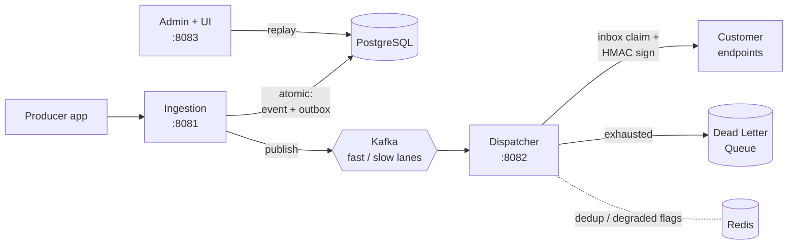

<div align="center">

# ⚡ Webhook Engine

### A distributed, fault-tolerant webhook delivery platform engineered for guaranteed event delivery under real-world failure.

Guarantees **at-least-once delivery**, **exactly-once processing**, and **crash-proof recovery** at scale.

<br>


<br>

### 🌐 Live Deployment

[](https://admin-service-y0wm.onrender.com)
[](https://ingestion-service-4zw7.onrender.com/actuator/health)

<sub>⏳ Hosted on Render's free tier — the first request may take **30–60s** to wake the service. The deployed instances showcase the **Admin Console** and **Ingestion API**; the full delivery pipeline runs locally via `docker-compose` (see [Quick Start](#-quick-start)).</sub>

</div>

---

## What is this?

When your app needs to notify thousands of customers that "a payment succeeded," you can't just call their servers and hope. Servers go down. Networks drop. Messages duplicate.

**Webhook Engine solves that.** It's a backend platform that accepts events and *guarantees* they reach every subscriber's endpoint — retrying on failure, never sending duplicates, isolating slow customers from fast ones, and capturing anything that fails for one-click replay.

> In short: **you hand it an event, it takes full responsibility for delivering it reliably.**

---

## ✨ Highlights

| | Capability | How |
|:--:|---|---|
| 📬 | **Never loses an event** | Transactional Outbox pattern — event + intent commit in one atomic DB write |
| 🎯 | **Never sends a duplicate** | Consumer-side Inbox idempotency (`event_id + endpoint_id`) |
| 🚦 | **Slow customers can't hurt fast ones** | Physically isolated fast / slow Kafka lanes with separate thread pools |
| 🔁 | **Failures self-heal** | Non-blocking retries with exponential backoff → Dead Letter Queue |
| ♻️ | **One-click recovery** | Crash-proof DLQ replay through the same atomic outbox path |
| 🔐 | **Secure by design** | HMAC-SHA256 signed payloads · SSRF protection · API-key RBAC |
| 📊 | **Fully observable** | Prometheus + Grafana dashboards, per-service health & metrics |

---

## 🖥️ The Platform in Action

> 👉 **Try the live console:** [admin-service-y0wm.onrender.com](https://admin-service-y0wm.onrender.com)

<div align="center">

### Admin Console — Endpoint Provisioning & Dead Letter Queue Recovery

<table>
  <tr>
    <td align="center" width="50%">
      <b>Endpoint Provisioning</b><br><br>
      
    </td>
    <td align="center" width="50%">
      <b>Dead Letter Queue Recovery</b><br><br>
      
    </td>
  </tr>
</table>

<br>

### Live Observability — JVM Runtime & Metrics via Grafana

<table>
  <tr>
    <td align="center" width="50%">
      <b>Connection Pools & Host Telemetry</b><br><br>
      
    </td>
    <td align="center" width="50%">
      <b>JVM Garbage Collection & Memory</b><br><br>
      
    </td>
  </tr>
</table>

</div>

---

## 🏗️ Architecture

Three focused microservices, connected by Kafka, backed by Postgres + Redis.



<details>
<summary><b>📖 How an event actually flows (click to expand)</b></summary>

<br>

**1 — Ingestion (guaranteed capture)**
The producer `POST`s an event. Ingestion deduplicates via Redis, then writes the **event and an outbox record in a single ACID transaction** — so it's impossible to accept an event without also recording the intent to publish it. Returns `202 Accepted` instantly.

**2 — Publish (dual-path, no lost events)**
A fast path publishes to Kafka the moment the transaction commits. A background **sweeper** (`FOR UPDATE SKIP LOCKED`) is the safety net — if the service crashes mid-publish, the sweeper picks the row up and publishes it when it recovers. Nothing is ever stranded.

**3 — Delivery (idempotent + isolated)**
The dispatcher consumes from **two isolated lanes** — healthy tenants on the fast lane (4 threads), degraded tenants on the slow lane (1 thread) — so one broken customer can't starve everyone else. Before each delivery it **claims the `(event_id, endpoint_id)` in an inbox table**, so a duplicate from Kafka never becomes a duplicate at the customer. Payloads are signed with **HMAC-SHA256**.

**4 — Resilience (self-healing)**
Failed deliveries retry with exponential backoff on separate topics (non-blocking). A **per-endpoint circuit breaker** trips a failing destination without affecting healthy ones. After retries are exhausted, the event lands in the **Postgres Dead Letter Queue**.

**5 — Recovery (crash-proof replay)**
From the Admin console, a failed event can be replayed with one click. Replay never touches Kafka directly — it writes back through the **same atomic outbox path**, so there's zero window where a replay can be lost.

</details>

---

## 🧠 Engineering Decisions Worth Noting

<details>
<summary><b>Why the Transactional Outbox instead of publishing directly to Kafka?</b></summary>

<br>

You can't atomically write to a database *and* a message broker — the classic **dual-write problem**. If you publish to Kafka then crash before recording it, you've delivered an event you have no record of. Committing the event and an outbox row in **one transaction** makes that impossible, and gives the DLQ and replay features a durable source of truth to build on.

</details>

<details>
<summary><b>Why an Inbox table for idempotency?</b></summary>

<br>

Kafka is at-least-once — it *will* redeliver a message during a rebalance. Without protection, that's a duplicate webhook (a double-charge, in payment terms). A unique `(event_id, endpoint_id)` claim via `INSERT ... ON CONFLICT DO NOTHING` collapses redeliveries into **exactly-once effect** at the customer.

</details>

<details>
<summary><b>Why a Postgres DLQ instead of just a Kafka DLQ topic?</b></summary>

<br>

A dead letter needs to be **queryable** (filter by tenant), **mutable** (mark as replayed), and **durable past Kafka's retention**. Kafka is a great append-only log but can't do any of those. So Kafka *catches* the failure; Postgres *manages* it. **Kafka is the log; Postgres is the system of record.**

</details>

<details>
<summary><b>What was intentionally traded off?</b></summary>

<br>

Strict FIFO ordering was **deliberately dropped in favor of throughput.** Non-blocking retries move a failed event aside so later events proceed — which breaks strict ordering but prevents one stuck event from blocking a tenant. Guarantee: *best-effort per-tenant ordering, at-least-once delivery.*

</details>

---

## 🛠️ Tech Stack

| Layer | Technology |
|---|---|
| **Language / Framework** | Java 17, Spring Boot 3.2 (Web, WebFlux, Data JPA, Security) |
| **Messaging** | Apache Kafka (idempotent producer, `@RetryableTopic`) |
| **Storage** | PostgreSQL (outbox, inbox, DLQ), Redis (dedup + circuit-breaker state) |
| **Resilience** | Resilience4j (per-endpoint circuit breakers) |
| **Observability** | Actuator · Micrometer · Prometheus · Grafana |
| **Testing** | JUnit 5 · Mockito · **Testcontainers** · WireMock |
| **Build** | Maven multi-module |

---

## 📁 Project Structure

```
webhook-platform/
├── ingestion-service/    → Event intake · Redis dedup · Transactional Outbox
├── dispatcher-service/   → Lane consumers · Inbox idempotency · HMAC signing · retries
├── admin-service/        → Endpoint registration · DLQ dashboard · crash-proof replay
├── shared-core/          → Domain entities, repositories, shared contracts
└── docker-compose.yml    → Postgres · Redis · Kafka · Prometheus · Grafana
```

---

## 🚀 Quick Start

**Prerequisites:** Java 17+, Docker, Maven 3.9+

```bash
# 1. Clone
git clone https://github.com/Ramalingam-N/webhook-platform.git
cd webhook-platform

# 2. Spin up infrastructure
docker compose up -d

# 3. Configure secrets
cp .env.example .env      # then fill in values

# 4. Build
mvn clean install

# 5. Run each service (separate terminals)
mvn -pl ingestion-service  spring-boot:run    # :8081
mvn -pl dispatcher-service spring-boot:run    # :8082
mvn -pl admin-service      spring-boot:run    # :8083
```

Open the **Admin console** at `http://localhost:8083` and **Grafana** at `http://localhost:3000`.

---

## 📡 API Quick Reference

**Live base URLs** (Render free tier — first call may cold-start):
- Ingestion → `https://ingestion-service-4zw7.onrender.com`
- Admin → `https://admin-service-y0wm.onrender.com`

<details>
<summary><b>Register a webhook endpoint</b></summary>

```bash
curl -X POST https://admin-service-y0wm.onrender.com/v1/admin/endpoints \
  -H "Content-Type: application/json" \
  -d '{ "tenantId": "tenant-alpha", "url": "https://api.customer.com/webhooks" }'
# → returns a generated HMAC signing secret (shown once)
```
</details>

<details>
<summary><b>Ingest an event</b></summary>

```bash
curl -X POST https://ingestion-service-4zw7.onrender.com/v1/events \
  -H "Idempotency-Key: $(uuidgen)" \
  -H "X-Admin-Api-Key: <ADMIN_KEY>" \
  -H "Content-Type: application/json" \
  -d '{
        "tenantId": "tenant-alpha",
        "eventType": "payment.succeeded",
        "payload": "{\"orderId\":\"ORD-1029\",\"amount\":99.50}"
      }'
# → 202 Accepted { "eventId": "..." }
```
</details>

<details>
<summary><b>Replay a failed event from the DLQ</b></summary>

```bash
curl -X POST https://admin-service-y0wm.onrender.com/v1/admin/dlq/<EVENT_ID>/replay \
  -H "X-Admin-Api-Key: <ADMIN_KEY>"
# → 202 Accepted (re-injected via the outbox)
```
</details>

---

## ✅ Testing

Reliability isn't claimed — it's **verified**, layer by layer, against real infrastructure.

| Layer | What it proves | Tooling |
|---|---|---|
| **Unit** | HMAC signing, SSRF validation, RBAC | JUnit · Mockito |
| **Persistence** | Idempotency constraints, `SKIP LOCKED` concurrency | Testcontainers (real Postgres) |
| **Service** | Outbox publish, circuit breaking, replay compensation | Mockito |
| **Web** | HTTP status contracts, auth boundaries | MockMvc |
| **End-to-End** | Happy path · exactly-once · failure → DLQ | Testcontainers + WireMock |

> The E2E suite boots **Postgres + Kafka + Redis**, fires a real event, and asserts a duplicate is delivered *exactly once* and a failing endpoint lands *safely in the DLQ*.

```bash
mvn test
```

---

<div align="center">

**Built to demonstrate production-grade distributed-systems engineering** — idempotency, exactly-once effect, compute isolation, and crash-proof recovery.

⭐ *If you find the architecture interesting, a star is appreciated.*

</div>
